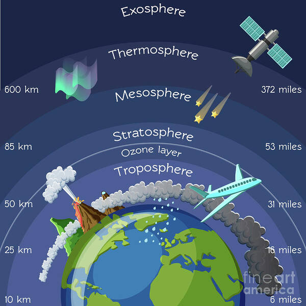
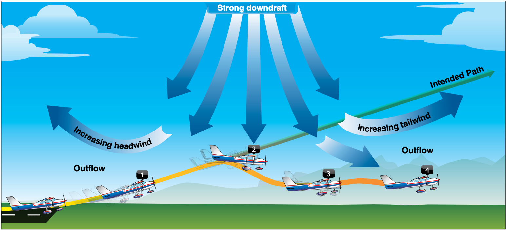

# Weather Fundamentals

## Composition of the Atmosphere

Layers:

Thermopause
Thermosphere
Mesophere
Stratosphere
Ozone layer
Troposphere

Weather happens in the Troposphere

## Atmosphering Circulation

Cause of all weather is uneven heating of the earth's surface

## Coriolis Force

Wind caused by earth's rotation

## Atmospheric Pressure

Sea level 14.7ls

Every 1000ft, pressure drops about an inch of mercury

Aneroid wafers

## Winds and Currents

The air over the sea heats up more slowly than over land.

High pressure - usually brings better weather
Move clockwise outwards and downwards (COD)
COD

Low pressure - brings worse weather
counter clockwise, inwards, upwards??

Bom cyclones

To get a tailwind
You want to be south of a low pressure,
north of a high pressure

## Effects of Obstructions on Winds

Obstructions can cause downdrafts

## Mountain Winds

Cross mountains at a 45degree angle - makes it so you can turn around without having to turn as much (90 egrees instead of 180)

Winds above 20kts gets ...scary??

## Windshear

Spot #1 you get an increase in performance

If you had a headwind and then 

Don't fly if there's any windshear.

Fly a landing approach faster in wind shear

## Atmospheric Stability

The atmosphere's ability to resist vertical lift

## Adiabatic Heating and Cooling

2 degrees / 5.4 F temperature drop per every 1000 ft of altitude

## Moisture and Humidity

Relative Humidity

RH represents the amount of water in air in percentage

Gives us insight into if cloud are going to form

Dew point

At 100% humidity, there will be some sort of visible moisture

## Temerature Inversions

When you go up in altitude and it gets warmer instead of cooler

## Cloud Characteristics

Stratus clouds: Low level, stable clouds
Stratocumulous

Towering cululus or cumulonimbus are tall and have a lot of 

Stratiform Clouds: The blanket clouds that stretch a ways

Cumulus clouds are fluffy

## Air Masses

## Cold fronts

Usually bring worse weather and move faster

All fronts bring wind changes and temperature changes

## Warm Front

## Occluded Front

When a cold from overtakes a warm front and everything mixes together

## Thunderstorms

Three stages

- Cumulus
- Mature
- Dissipating
    - Most dangerous because of down drafts

3 ingredients
- moisture
- unstable air
- lifting force

If there is a thunderstorm, you're supposed to stay 50-60 nm away. They can throw hail really, really far. (About 15m?)

Characterized by the anvil top shape

---

Water molecule is sent up. When it goes up, it becomes ice. The ice falls, hits the water molecules. When it hits, it creates static electricity.

## Icing

Three types

Clear icing: rain hits aircraft and then freezes
Rime: Freezes right away. Causes the most drag and decreases lift
Mixed

Want to land if you start to get icing

## Fog

### Radiation Fog

Think zombies on farm fog

Forms on clear nights with 
low temp and dew point spread is low/small

Overnight, air cools to it's dew point, condenses and creates fog

### Advection Fog 

Cold air mass moving over a warm air mass, fog happens from the cooling
"Marine layer"

### Steam fog

Air that moves over a warm body of water, heats up, forms steam. Less common

## Upslope Fog

Air mass is forced up a hill, cooled to it's dew point

### Precipitation fog

Extra fine, small rain particles

### Freexing fog

Less common around here.

Air particles frozen and suspended in the air

Need to know - 

Microbursts
Advection and radiation fogs
Thunderstorms
Vergo clouds - indication that there's a microburst

---

IMSAFE
I
Medication
Stress
Alchohol
Fatigue
E