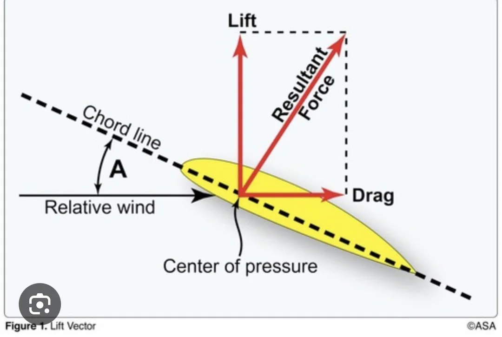

# Principles of Flight

<video width="320" height="240">
  <source src="../../static/video/1_principles_of_flight_spring/GMT20250416-011025_Recording_1760x900.mp4" type="video/mp4" />
  <!-- <source src="movie.ogg" type="video/ogg">
Your browser does not support the video tag. -->
</video>

## Parts of an airfoil

- Leading Edge
- Upper Camber
- Mean Camber
- Trailing Edge
- Lower Camber
- Chord ("C" in the coefficient of lift)

## Coefficient of Lift

L=CL * SA * .5P * V

<CoefficientOfLiftCalculation/>

L: Lift

CL: Angle of Attack: Angle between the chord line and the relative wind
- If the plane is level and falling straight down, the AOA would be 90 degrees

SA: Flaps

P: Atmospheric pressure

V: Airspeed

## Forces in Flight

thrust is only greater than drag when accelerating.

### Thrust
- Powered aircraft creates thrust from the propellers
- Gliders generate thrust by pointing the nose down

### Drag
- Parasitic
	- Lowest when going slow, highest when going fast
	- Skin friction drag
		- Rivets instead of screws
	- Form drag
		- Sleek shape instead of city bus
		
	- Interference drag
	    - Drag produced by the rough air meeting again on the other side of two parts of the plane that connect
		
- Induced
    - Highest at low speed
	- Byproduct of lift - the wingtip vortices
- Total
- Glide speed is the bottom of the drag curve. the most distance for the least
- Bernoullis Principal
	- If you move something through a fluid really fast it will create less drag
	- Equal time transient theory has been disproven
### Weight
- Always right in the direction of gravitational pull
### Lift

## Stability

What the aircraft does, or it's tendency after a change is applied to the controls.

- Positive Static Stability
	- Push forward on the yoke and let go, it will dip and correct, then the next dip will be smaller
- Neutral Static Stability
	- Push forward on the yoke and let go, it will keep going down at the same angle
- Negative Static Stability
	- Push forward on the yoke and let go, it will increase the downward angle

- Longitudinal Stability
	- stability from the nose to tail
	- The axis it pivots around is the lateral
- Lateral Stability
	- Pivots around the longitudinal axis
	- Most wings take a dihedral shape so when banked, the lower wind  naturally creates more lift and brings the aircraft back to
	- Swept back wing/keel effect
- All axis, longitudinal

## Airfoil designs
- Rectangle
	- Cheap, safe
- Elliptical
	- Cheap, stall at the same time
- Sweptback
	- Generally less safe but better performance at higher speeds
- Pointed tip
- Moderate taper
- High taper

Less of the vortex is created when the wing is thinner (the chord is shorter)

## Adverse yaw
- The reason we have rudders - to coordinate turns
- When you turn the yoke

Why do big aircraft have big spoilers instead of correcting more with a rudder

Stalls happen in the critical angle of attack, when inadequate lift is being generated. Stall can happen at any airspeed.

## Turning Tendencies
Forces that create a yaw
### Spiraling slipstream
	- The faster you get, the lower frequency the coil
### Torque
	- When the propeller turns, because of equal and opposite forces, it's trying to turn the airplane in the opposite direction
	- Does that cause enough unequal stress that they have to reinforce?
### P Factor
	- Higher at slow airspeed and high AOA
	- Lower at high
	- One side of the propeller is doing more work than the other side of the propeller 
### Gyroscopic procession
	- it's only when you're lifting the nose up or pushing it down
	- The propeller is a gyroscope - it 
	- If you push on a gyroscope, the pressure of the push isn't in full effect until a 90 degree turn has happened

## Wingtip Vortices
- High pressure air escapes to the top of the wing

## Wake Turbulence
- Wingtip vortices - a much larger airplane can create a very dangerous wake
- What's the worst for wake turbulence
	- Right (or left?) quartering tailwind
		- Why right instead of tailwind?

## Ground effect
- Reduction of induced drag - because the vortices can't form because the ground is in the way

It's half of your wingspan or the length of one wing.

Low wing airplanes can land more smoothly because they enter ground effect sooner in their descent.

## Slow Flight
- Maintaining altitude while slowing down
- Produce a lot of lift, produces a lot of drag, then you need more thrust to overcome it so you maintain altitude

## Region of Reverse Command
<!-- *They wanted to cover it again* -->
- The area behind the power curve behind the best glide
- Which side of the power curve are you on

## Slips
- Forward Slip
	- Use aileron 
- Side Slip
	- For landing in crosswind

# Recap

The motion through the air itself if relative wind
** Review the difference between AOA and relative wind

Angle of attack is the relationship between the chord line of the wing and the relative wind

induced
Paracitic
skin friction drag is paracitic

INTERFERENCE DRAG: Air splitting and meeting back together
The disturbance is greatest at two planes meeting each other

When you're going fast, the skin 

Adverse yaw is when one wing creates more lift than the other, meaning it also creates more drag and causes your node to veer off to the side

You have to add power in a steep turn because lift is not as vertical so you have to compensate with more thrust

When does an airplane stall? The textbook answer is "When you exceed your critical angle of attack."

Va is stall the plane before you break the plane
Vx is something else

The lighter you are, the lower the Va
A g5 (is that wit the color arcs?)

Wake turbulance is the worst at Lifting off. Happens when you're heavy, clean and slow

## Quiz

	
<strong>1. What are the forces of flight? In which directions do they oppose each other?</strong>

	Thrust (forward) and drag (backward) oppose each other, lift (upward) and weight (downward) oppose each other

 

	
<strong>
	2a. What is the chord line of the wing?

	2b. Relative wind?

	2c. Angle of Attack?
	</strong>

	2a. Chord line is a straight line from the leading to trailing edge

	2b. Relative wind is the wind opposite from the motion of the airplane

	2c. Angle of Attack (AOA) is the angle between the chord line and the relative wind

	

 

	
<strong>3. What are the two types of drag? When they are highest?</strong>

	Parasitic & Induced.
	
	Parasitic
	    - increases with speed
	Induced
	    - highest at low speed

 

	
<strong>4. If you are trying to maintain constant lift, and airspeed is decreased, what can be done to maintain the same lift?</strong>

	Add flaps to change the surface area of the wing, or increase AOA

 

	
<strong>5. What is positive vs negative static stability? What do we want in our trainer planes?</strong>

	We want to have positive stability. Positive static stability is the plane's resistance to moving from the current state of being. Negative static stability is when the plane continues to move with the initial deflection.

 

	
<strong>6. What is adverse yaw?</strong>

	Yaw created by the induced drag from the lift differential between the high and low wing in a turn

 

	
<strong>7. Why in a steep turn, do we need to pitch up and add power?</strong>

	Less vertical component of lift, so more AOA needed. Greater lift production causes induced drag, so more thrust is needed.

 

	
<strong>8. When does a plane stall?</strong>

	It reaches the critical angle of attack, airflow separates from the top of the wing

 

	
<strong>9. Name the turning tendencies and describe one of them</strong>

	P-factor: The downward moving propeller blade (right) at high angles of attack creates more thrust and lift causing a yawing and rolling moment to the left. Vice versa at descent angles, therefore requiring left rudder to compensate for the right turning moment.

 

	
<strong>10. What is maneuvering speed (Va)?</strong>

	The speed up to which you will stall the plane before you break the plane when you apply one full travel control movement. Essentially if I am below Va, and I pull up on the stick/yoke, I will stall before I exceed the G limit

 

	
<strong>11. What is wake turbulence? How do you avoid it?</strong>

	Turbulence caused by the spiraling wingtip vortices behind aircraft. More significant from heavy, clean and slow aircraft, sinking 300-500 fpm. Takeoff before the departing aircraft or land after the landing aircraft.

 

	
<strong>12. Why do we “float” in ground effect? Where is the ground effect strongest?</strong>

	The ground disrupts the wingtip vortices that cause induced drag, therefore making induced drag lower and allowing us to "float". Ground effect is ½ a wingspan from the ground and strongest the closer you get

