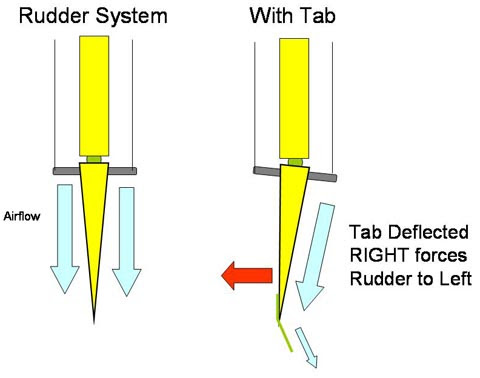
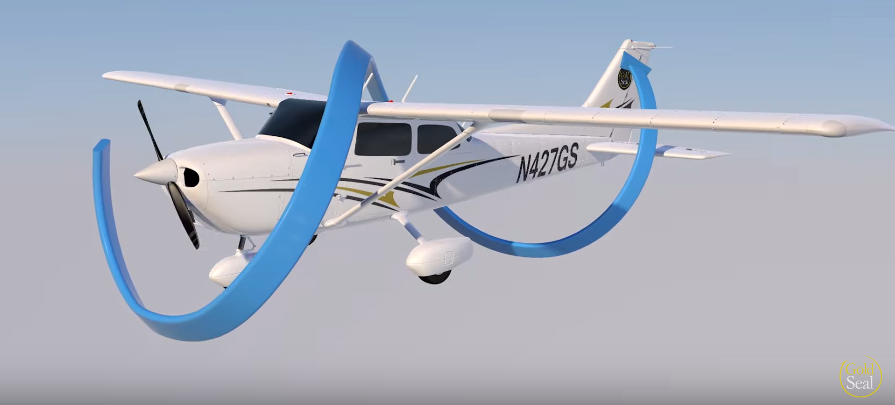
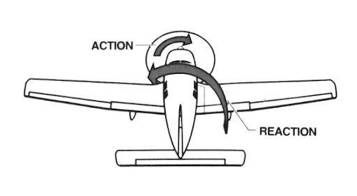

import Tabs from '@theme/Tabs';
import TabItem from '@theme/TabItem';
import InvisibilityCloak from '@site/src/components/InvisibilityCloak/InvisibilityCloak';
import VideoPlayer from '@site/src/components/VideoPlayer/VideoPlayer';

# Principles of Flight

<InvisibilityCloak>
	<Tabs>
		<TabItem value="spring2025" label="Spring 2025">
		<VideoPlayer src="/video/1_principles_of_flight_spring_2025/GMT20250416-011025_Recording_1760x900.mp4#t=600" />

		At about 01:07:00, Gabe mentions a whip stall. In case you were wondering what that is, it's when you pitch directly up and the entire wing stalls instead of just a partial stall.   

		<iframe width="560" height="315" src="https://www.youtube-nocookie.com/embed/Ee4PYDOBDNM?si=ud3aGheinSZQ2I9O" title="YouTube video player" frameBorder="0" allow="clipboard-write; encrypted-media; picture-in-picture; web-share" referrerPolicy="strict-origin-when-cross-origin" allowFullScreen></iframe>

		</TabItem>
	</Tabs>
</InvisibilityCloak>

## Parts of an airfoil

- Leading Edge
- Upper Camber
- Mean Camber
- Trailing Edge
- Lower Camber
- Chord ("C" in the coefficient of lift)

## Coefficient of Lift

L=CL * SA * .5P * V

<!-- <CoefficientOfLiftCalculation/> -->

L: Lift

CL: Angle of Attack: Angle between the chord line and the relative wind
- If the plane is level and falling straight down, the AOA would be 90 degrees

SA: Flaps

P: Atmospheric pressure

V: Airspeed

## Forces in Flight

There are four main forces in flight. Lift opposes weight and thrust opposes drag.

In steady flight, when summed, each opposing force equals zero. This includes steady climbs. It's when there's a change in velocity like a deceleration, increase in climb, decrease in climb, acceleration, etc that the forces will be unequal.

### Thrust
- Powered aircraft creates thrust from engines turning the propellers
- Gliders generate thrust by pointing the nose down

### Drag
- Parasitic
	- Lowest when going slow, highest when going fast
	- Skin friction drag
		- Rivets instead of screws
	- Form drag
		- Sleek shape instead of city bus
		
	- Interference drag
	    - Drag produced by the rough air meeting again on the other side of two parts of the plane that connect
		
- Induced
    - Highest at low speed
	- Byproduct of lift - the wingtip vortices
- Total
- Glide speed is the bottom of the drag curve. the most distance for the least
- Bernoullis Principal
	- If you move something through a fluid really fast it will create less drag
	- Equal time transient theory has been disproven
### Weight
- Always right in the direction of gravitational pull
### Lift

## Stability

What the aircraft does, or it's tendency after a change is applied to the controls.

- Positive Static Stability
	- Push forward on the yoke and let go, it will dip and correct, then the next dip will be smaller
- Neutral Static Stability
	- Push forward on the yoke and let go, it will keep going down at the same angle
- Negative Static Stability
	- Push forward on the yoke and let go, it will increase the downward angle

- Longitudinal Stability
	- stability from the nose to tail
	- The axis it pivots around is the lateral
- Lateral Stability
	- Pivots around the longitudinal axis
	- Most wings take a dihedral shape so when banked, the lower wind  naturally creates more lift and brings the aircraft back to
	- Swept back wing/keel effect
- All axis, longitudinal

## Airfoil designs
- Rectangle
	- Cheap, safe
- Elliptical
	- Cheap, stall at the same time
- Sweptback
	- Generally less safe but better performance at higher speeds
- Pointed tip
- Moderate taper
- High taper

Less of the vortex is created when the wing is thinner (the chord is shorter)

## Adverse yaw
- The reason we have rudders - to coordinate turns
- When you turn the yoke

Why do big aircraft have big spoilers instead of correcting more with a rudder

Stalls happen in the critical angle of attack, when inadequate lift is being generated. Stall can happen at any airspeed.

## Turning Tendencies
Forces that cause the airplane to yaw
This is why rudders have trim tabs that are always bent to the right

### Spiraling slipstream
- Turns the airplane to the **left**
- The slinky around the airplane pushes the vertical stabilizer 
- The faster you get, the lower frequency the coil

### Torque
- Turns the airplane to the **left**
  - You turn left because of the bank this one causes
- When the propeller turns, because of equal and opposite forces, it's trying to turn the airplane in the opposite direction

### P-Factor
- Turns the airplane to the **left**
- Each propeller has their own AOA. In level flight, each propeller has the same AOA. When pitching upward, the AOA is different for each propeller. One AOA increases and the other decreases, meaning one propeller is taking "bigger bites" out of the air and doing more work. This imbalance yaws the plane to the side with the greater AOA.

<iframe width="560" height="315" src="https://www.youtube-nocookie.com/embed/zwd9I_fIVZc?si=ER6Ky8zqisQ3zVeU" title="YouTube video player" frameborder="0" allow="clipboard-write; encrypted-media; picture-in-picture; web-share" referrerpolicy="strict-origin-when-cross-origin" allowFullScreen></iframe>

Takeaways:
- One side of the propeller is doing more work than the other side of the propeller 
- Higher at slow airspeed and high AOA
- Lower at high AOA

### Gyroscopic procession
- When pitching up, turns the airplane to the **right**. When pitching down, turns the airplane to the **left**.
- If you push on a gyroscope, the pressure of the push isn't in full effect until a 90 degree turn has happened.

<iframe width="560" height="315" src="https://www.youtube-nocookie.com/embed/n5bKzBZ7XuM?si=u2gfO6_50KgtE_pR&amp;start=42" title="YouTube video player" frameborder="0" allow="clipboard-write; encrypted-media; picture-in-picture; web-share" referrerpolicy="strict-origin-when-cross-origin" allowFullScreen></iframe>

**Video Summary:** In other words, if you have an orbiting object and you push up on it at a certain point and down on it on the opposite side of the orbit, the orbit rotates on the axis drawn between the two pressure points. This axis is 90° from if there was no spinning and the orbit were a motionless solid object.

## Wingtip Vortices
- High pressure air below the wing escapes to the top of the wing
- The high-pressure air under the wing travels outward, away from the fuselage

<iframe width="560" height="315" src="https://www.youtube-nocookie.com/embed/duSZ1hyK7sY?si=660sRC0S0LtpLk7D" title="YouTube video player" frameborder="0" allow="clipboard-write; encrypted-media; picture-in-picture; web-share" referrerpolicy="strict-origin-when-cross-origin" allowFullScreen></iframe>

:::info

There's a test question that got me every time that asks what direction wingtip vorticies spin. Yes, the top of the vortex spins inward toward the plane, but the question is asking about how they start, which is air moving outward, away from the plane.

> Vortices are generated from the moment an aircraft leaves the ground (until it touches down), since trailing vortices are the byproduct of wing lift. [Figure 14-46] The vortex circulation is outward, upward, and around the wingtips when viewed from either ahead or behind the aircraft.

[PHAK Chapter 14: Airport Operations](https://www.faa.gov/sites/faa.gov/files/16_phak_ch14_0.pdf)

See `Wake Turbulence > Vortex Behavior` on page 14-27

:::

### Wake Turbulence
- Wingtip vortices are dangerous when created by a much larger airplane can create a very dangerous wake
- The worst when a plane is heavy, clean and slow
- Sink about 100ft/minute
- What's the worst for wake turbulence
	- Right (or left?) quartering tailwind
		- Why right instead of tailwind?

## Ground effect
- Reduction of induced drag - because the vortices can't form because the ground is in the way

It's half of your wingspan or the length of one wing.

Low wing airplanes can land more smoothly because they enter ground effect sooner in their descent.

## Slow Flight
- Maintaining altitude while slowing down
- Produce a lot of lift, produces a lot of drag, then you need more thrust to overcome it so you maintain altitude

## Region of Reverse Command
<!-- *They wanted to cover it again* -->
- The area behind the power curve behind the best glide
- Which side of the power curve are you on

## Slips
- Forward Slip
	- Use aileron 
- Side Slip
	- For landing in crosswind

## Load Factor

# Recap

The motion through the air itself if relative wind
** Review the difference between AOA and relative wind

Angle of attack is the relationship between the chord line of the wing and the relative wind

induced
Paracitic
skin friction drag is paracitic

INTERFERENCE DRAG: Air splitting and meeting back together
The disturbance is greatest at two planes meeting each other

When you're going fast, the skin 

Adverse yaw is when one wing creates more lift than the other, meaning it also creates more drag and causes your node to veer off to the side

You have to add power in a steep turn because lift is not as vertical so you have to compensate with more thrust

When does an airplane stall? The textbook answer is "When you exceed your critical angle of attack."

Va is stall the plane before you break the plane
Vx is something else

The lighter you are, the lower the Va
A g5 (is that wit the color arcs?)

Wake turbulance is the worst at Lifting off. Happens when you're heavy, clean and slow

## Quiz

	
<strong>1. What are the forces of flight? In which directions do they oppose each other?</strong>

	Thrust (forward) and drag (backward) oppose each other, lift (upward) and weight (downward) oppose each other

 

	
<strong>
	2a. What is the chord line of the wing?

	2b. Relative wind?

	2c. Angle of Attack?
	</strong>

	2a. Chord line is a straight line from the leading to trailing edge

	2b. Relative wind is the wind opposite from the motion of the airplane

	2c. Angle of Attack (AOA) is the angle between the chord line and the relative wind

	

 

	
<strong>3. What are the two types of drag? When they are highest?</strong>

	Parasitic & Induced.
	
	Parasitic
	    - increases with speed
	Induced
	    - highest at low speed

 

	
<strong>4. If you are trying to maintain constant lift, and airspeed is decreased, what can be done to maintain the same lift?</strong>

	Add flaps to change the surface area of the wing, or increase AOA

 

	
<strong>5. What is positive vs negative static stability? What do we want in our trainer planes?</strong>

	We want to have positive stability. Positive static stability is the plane's resistance to moving from the current state of being. Negative static stability is when the plane continues to move with the initial deflection.

 

	
<strong>6. What is adverse yaw?</strong>

	Yaw created by the induced drag from the lift differential between the high and low wing in a turn.
	A bank to the right creates yaw to the left which requires right rudder to coordinate

 

	
<strong>7. Why in a steep turn, do we need to pitch up and add power?</strong>

	Less vertical component of lift, so more AOA needed. Greater lift production causes induced drag, so more thrust is needed.

 

	
<strong>8. When does a plane stall?</strong>

	It reaches the critical angle of attack, airflow separates from the top of the wing

 

	
<strong>9. Name the turning tendencies and describe one of them</strong>

	| Turning Tendency | Description | Effect |
	|-----------------|-------------|---------|
	| P-factor | The downward moving propeller blade (right) at high angles of attack creates more thrust and lift | Turns the place to the **left** |
	| Torque | Equal and opposite reaction to propeller rotation | Turns airplane to the **left** due to banking |
	| Spiraling Slipstream | The slinky-like effect of air wrapping around the airplane pushes the vertical stabilizer right | Turns airplane to the **left** |
	| Gyroscopic Precession | Force applied to spinning propeller manifests 90° later in rotation | Turns airplane **right** when pitching up, **left** when pitching down |

	All assumes a propeller that turns clockwise as viewed from the cockpit

 

	
<strong>10. What is maneuvering speed (Va)?</strong>

	The speed up to which you will stall the plane before you break the plane when you apply one full travel control movement. Essentially if I am below Va, and I pull up on the stick/yoke, I will stall before I exceed the G limit

 

	
<strong>11. What is wake turbulence? How do you avoid it?</strong>

	Turbulence caused by the spiraling wingtip vortices behind aircraft. More significant from heavy, clean and slow aircraft, sinking 300-500 fpm. Takeoff before the departing aircraft or land after the landing aircraft.

 

	
<strong>12. Why do we “float” in ground effect? Where is the ground effect strongest?</strong>

	The ground disrupts the wingtip vortices that cause induced drag, therefore making induced drag lower and allowing us to "float". Ground effect is ½ a wingspan from the ground and strongest the closer you get

<InvisibilityCloak>

### Class Quiz Discussion

<Tabs>
  <TabItem value="spring2025" label="Spring 2025">
    <VideoPlayer src="/video/2_engines_electrical_systems_spring_2025/GMT20250430-010349_Recording_1760x900.mp4#t=0,1182" />
  </TabItem>
</Tabs>

</InvisibilityCloak>
