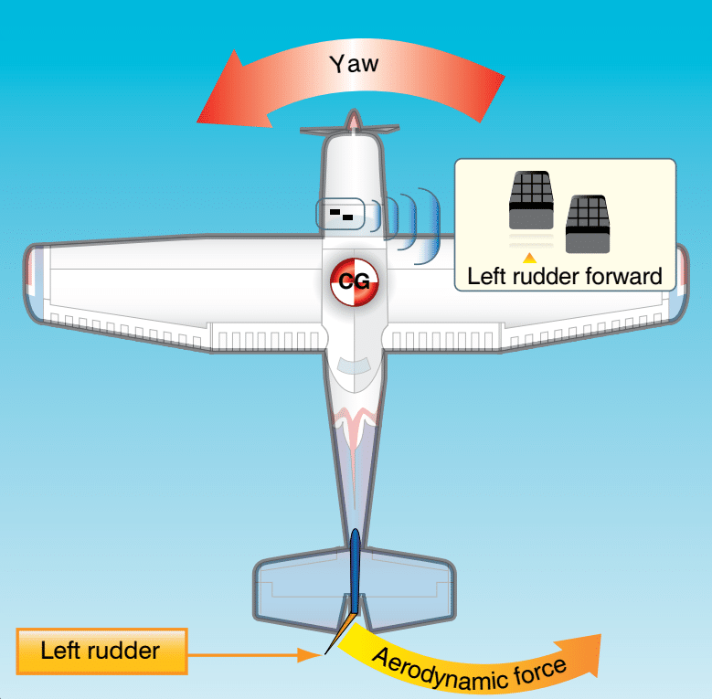
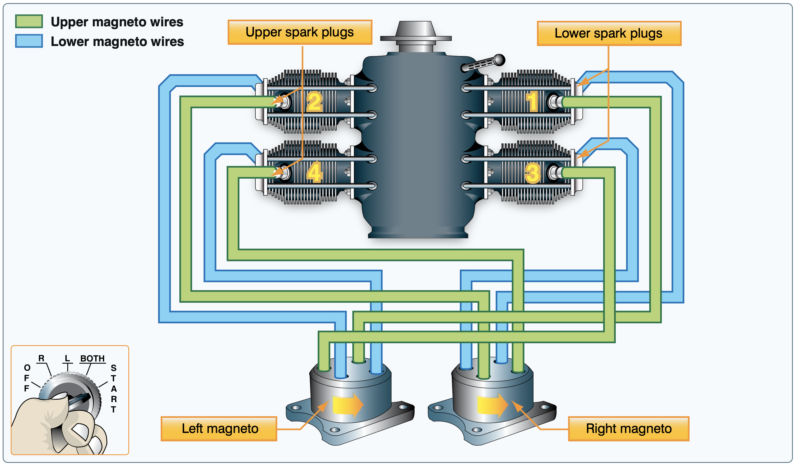

import Tabs from '@theme/Tabs';
import TabItem from '@theme/TabItem';
import InvisibilityCloak from '@site/src/components/InvisibilityCloak/InvisibilityCloak';
import VideoPlayer from '@site/src/components/VideoPlayer/VideoPlayer';

# Aircraft Systems

<InvisibilityCloak>
    <Tabs>
        <TabItem value="spring2025" label="Spring 2025">
            <VideoPlayer src="/video/2_engines_electrical_systems_spring_2025/GMT20250430-010349_Recording_1760x900.mp4#t=1235" />
            <ZoomLink url="https://us06web.zoom.us/rec/share/hSYd900TKmmia5uNVeIFz7q86R2_PcvLjFL0-Cj_y8zDb_-DHECGjFjnpFqo-wYL.wMM4ddAh31QrHrDq" passcode="Y%2..T4E" />
        </TabItem>
        <TabItem value="summer2025" label="Summer 2025">
            Important! I think this video might be for the wrong topic
            <ZoomLink url="https://us06web.zoom.us/rec/share/sZYs0XcM5_zDvTIkK2ngXiWTZtYSQCDwcyPW2dDJmrf2pbyCbHoJ-xvZWPFwDLQ.Zw4qq8ZXSSed_DI5" passcode="*bTMt.2g" />
        </TabItem>
    </Tabs>
</InvisibilityCloak>

## Primary Flight Controls

How the airplane controls the movement around the different axis

### Alierons
Turn the airplane by changing the chord lines opposite from each other

### Elevator
Kicks the tail up or down

### Rudder
For adverse yaw

## Secondary Flight Controls

### Trim
Poor Man's Autopilot
You can have trim on any of the controls.

There's manual trim on small planes that's made

If you want the elevator down, the trim tab will move up

### Flaps
Leading edge (Kreuger) flaps and trailing
edge (Fowler) flaps,

Basic section
Plain flaps (RV)
Split flap
Slotted flowler flap
Slotted flap

### Spoilers
Called spoilers because they "spoil" the airflow
To counteract adverse yaw

---

## Powerplant
Engine!!
All the Cesnas at Twin Oaks:
- 4 cylander
- horizontally opposed
  - creates better balanced forces
- naturally aspirated - breathing natrual air, (not spooled, more compressed air)
- air cooled - fins with more surface area for the air to naturally cool it down

### Four Stroke Cycle
Intake
Compression
Combusion
Exhaust

### Detonation and Preignition
**Detonation** -Rather than combusting in the powerstroke, it's just exploding (during the compression stroke) (because the piston isn't moving)

Causes include:
- Fuel grade lower than needed
- Engine overheating

Watch cylinder head temperatures (CHTs) 

**Preignition** - the spark plugs light the fuel prematurely or on the intake cycle. This causes opposing forces out of cycle, e.g. the two sides of a horizontally opposed engine pressing on the connecting rods and other engine components

Causes include:
- Cracked spark plug tip
- burned exhaust valve
- "anything that can act as a glow plug to ignite the charge prematurely"

<InvisibilityCloak>
:::note[Course Questions/Feedback]

Is there a better spot to talk about the propeller? It feels a little out of place here

:::
</InvisibilityCloak>

## Propeller
Twisted because needs to take more of a "bite" from the air closer to the nose because it's moving more slowly

The faster the edge of the propeller is traveling, the more drag it's producing
Big planes add blades instead of longer propellers because the edges approach the speed of sound and get much less efficient

TIL: You always increase drag with speed, but the drag coefficient drops after you break the sound barrier. [NASA: Drag Coefficient](https://www.grc.nasa.gov/www/k-12/VirtualAero/BottleRocket/airplane/dragco.html)

### Fixed Pitch
The simpler of the two types. The propeller blades are fixed at a certain pitch and do not rotate

### Constant Speed
More complex, the propeller blades can rotate within the spinner in order to take bigger or smaller "bites" of the air, increasing or decreasing the blade's angle of attack. This allows the propeller to spin at lower RPMs while still creating the same amount of force as it would spinning at a higher rate with a lower angle of attack.

<InvisibilityCloak>
:::note[Course Questions/Feedback]

This lower speed of revolution also creates less drag (right?)

:::
</InvisibilityCloak>

<iframe width="560" height="315" src="https://www.youtube-nocookie.com/embed/kCSKhDL0bXM?si=qHVPMbRJ9wVsLn3N&amp;start=6" title="YouTube video player" frameborder="0" allow="clipboard-write; encrypted-media; picture-in-picture; web-share" referrerpolicy="strict-origin-when-cross-origin" allowfullscreen></iframe>

## Induction System
How does the air and the fuel gets into the engine

> Mixture ratios span a spectrum from a rich of 6 to 1 to a lean of 18 to 1 depending on combustion chamber design and operating conditions.
[AOPA](https://www.aopa.org/training-and-safety/students/solo/special/the-fuel-air-mixture)

<InvisibilityCloak>
:::note[Course Questions/Feedback]

Nick mentions 40% and 60% - sometimes giving actual numbers like that can be confusing without a heads up that they're not real numbers

:::
</InvisibilityCloak>

### Carburated engines
Venturi draws air and fuel and <TooltipInlineText text="atomizes the fuel together" tooltip="Breaks fuel into a fine mist or spray of tiny droplets" />.
There's a needle that 

Any time you reduce the throttle, you "pull the carb heat out" (turn the heat on) to apply heat on the carb to prevent icing. This decreases performance/RPM because you're spreading out the air going into the fuel/air mixture, reducing the amount of air going into the mixture, making it leaner because the fuel flow is the same.

<InvisibilityCloak>
:::note[Course Questions/Feedback]

What does "pull the carb heat out" mean? Is it pulling the lever out that applies the heat?

:::
</InvisibilityCloak>

Icing happens because you're accelerating air

Ice can form in
- the butterfly valve
- the venturi because it's creating a low pressure (cooler) system

### Fuel Injected Engines
Instead of a carburator (mechanical), you have an electrical system called fuel air control unit (FCU) that's governing the ratio of fuel to air

The injector does the atomizing of the fuel electronically
They're more eficient
They can have a vapor lock

**Full Authority Digital Engine Control (FADEC):**

Full authroity, meaning all control inputs to the engine go through the FADEC and there's no pilot override.
Electrical systems that allow for override are electronic control units (ECU)s or electronic engine control (EEC)s

RV-12s use a FADEC

They are redundant in case of failure.

:::info

From [Skybrary](https://skybrary.aero/articles/full-authority-digital-engine-control-fadec):

- If a total FADEC failure occurs, the engine fails.
- Upon total FADEC failure, pilots have no manual controls for engine restart, throttle, or other functions.
- Single point of failure risk can be mitigated with redundant FADECs (assuming that the failure is a random hardware failure and not the result of a design or manufacturing error, which may cause identical failures in all identical redundant components).

:::

<InvisibilityCloak>
:::note[Course Questions/Feedback]

Hand-propping apparently does not work on an engine that utilizes a FADEC

There's an Audi engine that is apparently technically a car engine but there's at least one airplane that will try using it

:::
</InvisibilityCloak>

## Ignition Sysyem
2 magnetos for 4 cylinders with 8 spark plugs.

You need the battery to start but 

Impulse coupling..??
Magnetic field spins to generate magnetic field

Magneto is a self contained (from other electrical systems) magnetic field
There's a ball that spins around in it
There's a spring in it - when you start, it uses

Each magneto connects to one of the spark plugs in each cylanger

If a magneto failed, you'd not really be able to climb. You'd probably drop around 4000 RPM

## Oil System

Wet sump system
There's oil sitting at the bottom of the crankcase, the crankshaft dips into the pool then flings it all over the engine
It doesn't froth as long as it isn't over full

Dry sump system
Oil is stored in a sperate resivor and pumped through the engine
Scavange pump
Oil cooler

## Cooling
RV is air and liquid cooled

Shock cooling is a thing - causes cracks in the engine

## Exhaust
The hot air has to go somewhere or it can't intake more air

MANIFOLD, NOT SHROUD
Goes trhough a heat shroud  - it's a cabin and carburator heater. If there's a crack in the shroud you can get CO poisioning. You'll get light headed

Exhaust gas is over 1000 degrees

## Starter System
You have to turn on the master switch (the battery) before you can start the engine

## Electrical System
The electrical system digram is in the POH

Buses are like power strips that power multiple components coming from it.
A bus bar is a hunk of metal that's kept in a housing to prevent accidental contact, used instead of lots of exposed wires

14v or 28v system with 12v or 24v batteries

The RVs have lanes that are generators, not alternators
Casnas have alternators, not generators

(alternators efficiant at low RPMs, generators are worse, they produce)

The RV has no magnetos, It has a backup EMS battery

The master switch turns on both the battery and alternator at the same time

You can turn off radios, lights, anything electrical you can

## Landing Gear
Tricycle

Castering nose wheel - rudder also turns the wheels

Tailwheels - bush flying

Lubscome tail wheel planes

## Hydraulics
Shimmy dampener - keeps the nosewheel from rapidly turning back and forth - some use air instead of fluid
Oleo strut - in the landing gear

<InvisibilityCloak>
:::note[Course Questions/Feedback]

~ 01:30:00

The RV12 doesn't have the Oleo strut. If you want to be extra technical I think the canopy has hydraulics?

Can these be written on the slides..?

:::
</InvisibilityCloak>

Brakes

## Scenarios

Explain what you would do or check in each of the following scenarios:

	
<strong>1. During runup you switch from both mags to R and the engine rms decreases. Then back to both. Then you switch the key to the left and there is no mag drop.  Which system does this pertain to and is there a problem?</strong>

    - Electrical > ignition system problem
    - The ground (or p-lead) is faulty
    - This is dangerous because you wouldn't be able to turn the plane off

	The p-lead is faulty. If the RPMs don't drop, it means that magneto isn't grounded and it's not turning off when it's supposed to. This is unsafe because the magneto could fire even with the key off.

	
<strong>2. On a cross country flight you've climbed to your desired altitude and leaned the mixture. You're on a time crunch so you increase your RPM to get there in time. You start to notice high <TooltipInlineText text="CHT" tooltip="Cylinder Head Temperature" /> and low <TooltipInlineText text="EGT" tooltip="Exhaust Gas Temperature" />.  What's the likely problem and how do you resolve it?</strong>

	This could mean detonation. You would likely hear engine banging if this is occurring.

	Actions to take:
	- Enrich the mixture
	- Lower the RPM
	- Descend to cool the engine

 

**Unanswered**

	
<strong>3. We are flying from Twin Oaks to KMFR on a night cross country and you notice that the ALT INOP light turns on and the Ammeter is showing a discharge. Nearest airport is 30 minutes away.  What will you do?</strong>

	
<strong>4. You are on a long XC in the winter. The only nearby airport is a small grass strip with no services nearby. There is a faint smell of gas that is slowly getting stronger.  What system is likely causing the problem? Why? What should we do?</strong>

	
<strong>5. You're conducting a cross-country flight in a Cessna 150 on a hot summer day. After climbing to cruise altitude, you notice that the oil temperature gauge is indicating higher than normal, and the cylinder head temperature (CHT) is also approaching the upper limit.  How would you manage this situation?</strong>

	
<strong>6. You are taking your plane on a cross country from an airport other than your home airport and you see the oil level is low.  How would you go about finding the correct oil for your airplane?</strong>

	
<strong>7. Decoded: Unalakleet Airport, on the 15th of the month at 19:56 ZULU, Automatic Report, Winds from 080 at 10 Knots, Visibility 10SM, Light Rain, Clouds Few at 2,300, Overcast at 3,500, Temperature 11(oC) Dew Point 7(oC), Altimeter 29.61</strong>

 

## Quiz

	
<strong>1. What are the primary flight controls? What do they control?</strong>

	- Ailerons - Roll
	- Rudder - Yaw
	- Elevator - Pitch

 

	
<strong>2. What are the secondary flight controls? What do they do?</strong>

	- Trim - Helps hold an attitude
	- Flaps - Helps fly a steeper descent at a constant airspeed. Greater lift for slower speed
	- Spoilers - Spoil the lift on the surface of the wing, putting the weight on the wheels

 

	
<strong>3. What are the 4 strokes of our aircraft's internal combustion engines?</strong>

	Intake, Compression, Combustion, Exhaust

 

	
<strong>4. What is detonation? Pre Ignition? How do you fix them?</strong>

	**Detonation** - When the fuel/air mixture explodes rather than burns evenly

	**Pre Ignition** - Hot spots on the cylinder ignite the fuel/air mixture early

 

	
<strong>5. Why is the propeller twisted?</strong>

	Greater angle of attack at the hub to provide equal lift across the blade

 

	
<strong>6. How does fuel get drawn into the carburetor?</strong>

	Venturi effect creates a low pressure zone, sucking the fuel into the air

 

	
<strong>7. Where does ice form in the carb and under what conditions? If it's 60 degrees outside (F) can carb ice still form? 70? 80?</strong>

	When that low pressure zone is formed, the temp drops and ice will form there. Ice can form usually under 70 degrees but when it's hotter on the ground, at altitude it will most often be cooler, so the risk is basically always there. Even if there is no visible moisture in the air, like on a clear summer day.

 

	
<strong>8. What are magneto's? How are they connected to the rest of the ignition system?</strong>

	Self contained electrical generator units with a spinning electromagnet inside that each provide power to one of each of the two spark plugs on each cylinder, essentially allowing for one of them to run the engine if the other one fails

 

	
<strong>9. How do carb and cabin heat work?</strong>

	Air for the carb and cabin heat are routed over the exhaust shroud allowing the heat from the exhaust to heat up the air.

 

	
<strong>10. Explain what you would do or check in each of the following scenarios?</strong>

	**a. In the summer, climbing to cruise altitude and the CHT's are in the red**

	Lower the pitch, reduce rpm, accelerate to increase airflow over the engine

	**b. At runup, you pull the carb heat and watch the engine rpm. Nothing changes**

	Take the airplane back to get checked out, some problems you will not be able to solve yourself

	**c. On takeoff, you appear to take longer than usual to get off the ground and your climb performance is greatly reduced. Density altitude is standard**

	Verify carb heat is pushed in and magnetos are on BOTH

	**d. In cruise the engine appears to die or cut out, losing large amounts of rpm for short periods of time**

	Likely carb ice, so pull carb heat and let run for several minutes

## Lesson Supplements

<!-- [The Pros And Cons Of Carbureted vs. Fuel Injected Engines](https://www.boldmethod.com/learn-to-fly/systems/carbureted-vs-fuel-injected-engines-in-your-airplane-and-how-it-works/) -->

[How a Magneto Works](https://www.aopa.org/news-and-media/all-news/2019/december/flight-training-magazine/how-it-works-magneto)

<iframe width="560" height="315" src="https://www.youtube-nocookie.com/embed/NLT2GzgGWGQ?si=Fs0oECsT1WOeMnyx" title="YouTube video player" frameborder="0" allow="accelerometer; autoplay; clipboard-write; encrypted-media; gyroscope; picture-in-picture; web-share" referrerpolicy="strict-origin-when-cross-origin" allowfullscreen></iframe>

<iframe width="560" height="315" src="https://www.youtube-nocookie.com/embed/BW7DhcU4HMA?si=EbmtUuPLxms3fHJf" title="YouTube video player" frameborder="0" allow="accelerometer; autoplay; clipboard-write; encrypted-media; gyroscope; picture-in-picture; web-share" referrerpolicy="strict-origin-when-cross-origin" allowfullscreen></iframe>