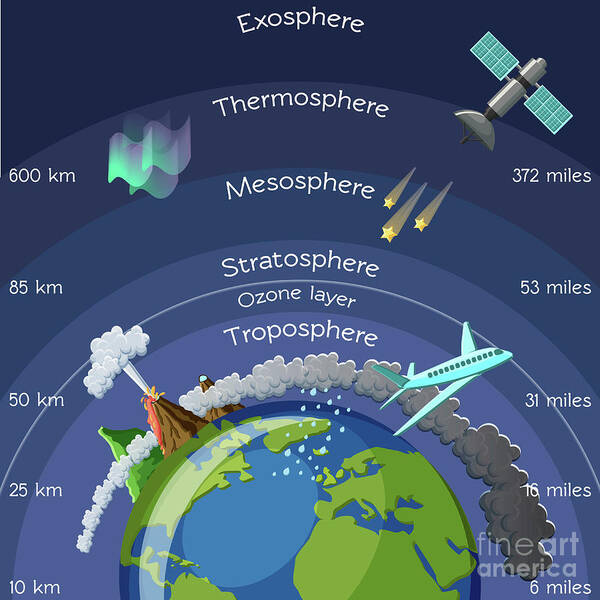
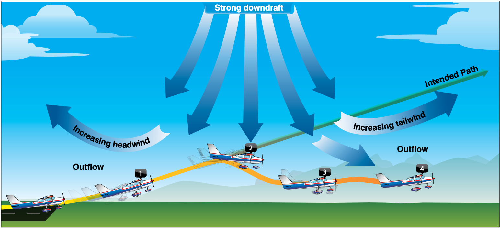

import Tabs from '@theme/Tabs';
import TabItem from '@theme/TabItem';
import InvisibilityCloak from '@site/src/components/InvisibilityCloak/InvisibilityCloak';
import VideoPlayer from '@site/src/components/VideoPlayer/VideoPlayer';

# Weather Fundamentals

## Composition of the Atmosphere

Layers:

Thermopause
Thermosphere
Mesophere
Stratosphere
Ozone layer
Troposphere

Weather happens in the Troposphere

## Atmosphering Circulation

Cause of all weather is uneven heating of the earth's surface

## Coriolis Force

Wind caused by earth's rotation

## Atmospheric Pressure

Sea level 14.7ls

Every 1000ft, pressure drops about an inch of mercury

Aneroid wafers

## Winds and Currents

The air over the sea heats up more slowly than over land.

High pressure - usually brings better weather
Move clockwise outwards and downwards (COD)
COD

Low pressure - brings worse weather
counter clockwise, inwards, upwards??

Bom cyclones

To get a tailwind
You want to be south of a low pressure,
north of a high pressure

## Effects of Obstructions on Winds

Obstructions can cause downdrafts

## Mountain Winds

Cross mountains at a 45degree angle - makes it so you can turn around without having to turn as much (90 egrees instead of 180)

Winds above 20kts gets ...scary??

## Windshear

Spot #1 you get an increase in performance

If you had a headwind and then 

Don't fly if there's any windshear.

Fly a landing approach faster in wind shear

## Atmospheric Stability

The atmosphere's ability to resist vertical lift

## Adiabatic Heating and Cooling

2 degrees / 5.4 F temperature drop per every 1000 ft of altitude

## Moisture and Humidity

Relative Humidity

RH represents the amount of water in air in percentage

Gives us insight into if cloud are going to form

Dew point

At 100% humidity, there will be some sort of visible moisture

## Temerature Inversions

When you go up in altitude and it gets warmer instead of cooler

## Cloud Characteristics

Stratus clouds: Low level, stable clouds
Stratocumulous

Towering cululus or cumulonimbus are tall and have a lot of 

Stratiform Clouds: The blanket clouds that stretch a ways

Cumulus clouds are fluffy

## Air Masses

## Cold fronts

Usually bring worse weather and move faster

All fronts bring wind changes and temperature changes

## Warm Front

## Occluded Front

When a cold from overtakes a warm front and everything mixes together

## Thunderstorms

Three stages

- Cumulus
- Mature
- Dissipating
    - Most dangerous because of down drafts

3 ingredients
- moisture
- unstable air
- lifting force

If there is a thunderstorm, you're supposed to stay 50-60 nm away. They can throw hail really, really far. (About 15m?)

Characterized by the anvil top shape

---

Water molecule is sent up. When it goes up, it becomes ice. The ice falls, hits the water molecules. When it hits, it creates static electricity.

## Icing

Three types

Clear icing: rain hits aircraft and then freezes
Rime: Freezes right away. Causes the most drag and decreases lift
Mixed

Want to land if you start to get icing

## Fog

### Radiation Fog

Think zombies on farm fog

Forms on clear nights with 
low temp and dew point spread is low/small

Overnight, air cools to it's dew point, condenses and creates fog

### Advection Fog 

Cold air mass moving over a warm air mass, fog happens from the cooling
"Marine layer"

### Steam fog

Air that moves over a warm body of water, heats up, forms steam. Less common

## Upslope Fog

Air mass is forced up a hill, cooled to it's dew point

### Precipitation fog

Extra fine, small rain particles

### Freezing fog

Less common around here.

Air particles frozen and suspended in the air

Need to know - 

Microbursts
Advection and radiation fogs
Thunderstorms
Vergo clouds - indication that there's a microburst

---

IMSAFE
I
Medication
Stress
Alchohol
Fatigue
E

## Quiz

    
<strong>1. Decode this METAR: KHIO 131653Z 13005KT 6SM -RA BR OVC033 04/04 A2979 RMK AO2 SLP090 P0003 T00440039</strong>

    Hillsboro  
    13th at 8:53am  
    Wind 130 @ 05kts  
    6SM visibility  
    Light rain  
    Mist  
    Overcast 3300  
    Temperature 4°C  
    Dewpoint 4°C  
    Altimeter 29.79

 

    
<strong>2. What is a PIREP? Are there different kinds? What are they for?</strong>

    A pilot report  
    There can be urgent or normal PIREPs  
    They are often for cloud cover, icing, turbulence, wind shear, etc.

 

    
<strong>3. Decode this TAF: KHIO 131137Z 1312/1412 14004KT 4SM BR OVC005 FM131800 14008KT 5SM -RA SCT010 OVC025 FM132100 13008KT 2SM -RA BR BKN007 OVC015 FM140500 15010KT 4SM -RA BR OVC015</strong>

    Hillsboro  
    13th at 3:37am from the 13th at 12 to the 14th at 12  
    Winds 140 @ 04kts 4SM visibility mist overcast 500  
    From 13th at 10am winds 140 @ 08kts 5SM visibility light rain scattered 1000 overcast 2500  
    From 13th at 1pm winds 130 @ 08kts 2SM visibility light rain mist broken 700 overcast 1500  
    From 13th at 9pm winds 150 @ 10kts 4SM visibility light rain mist overcast 1500

 

    
<strong>4. What are the 3 kinds of AIRMETS?</strong>

    Tango - Turbulence  
    Sierra - Mountain Obscuration or IFR  
    Zulu - Icing

 

    
<strong>5. What are examples of some SIGMETS? How long is a convective SIGMET valid for?</strong>

    Tango, Sierra, Zulu, and a convective SIGMET is valid for 2 hours.  
    Tornadoes, thunderstorms are examples.

 

    
<strong>6. What is Hypoxia vs Hyperventilation?</strong>

    Hypoxia is not enough oxygen in the body  
    Hyperventilation is too much CO2

 

    
<strong>7. How long should you wait after drinking to fly?</strong>

    8 hours bottle to throttle, 0.04 blood alcohol

 

    
<strong>8. What does IMSAFE stand for?</strong>

    
    Illness  
    Medication  
    Stress  
    Alcohol  
    Fatigue  
    Emotion

 

    
<strong>9. What are the 5 hazardous attitudes?</strong>

    Macho: "I can do it!"
    Anti-Authority: "Don't tell me what to do!"
    Impulsivity: "Do something quickly!"
    Invulnerability: "It won't happen to me!"
    Resignation: "What's the use?"

 