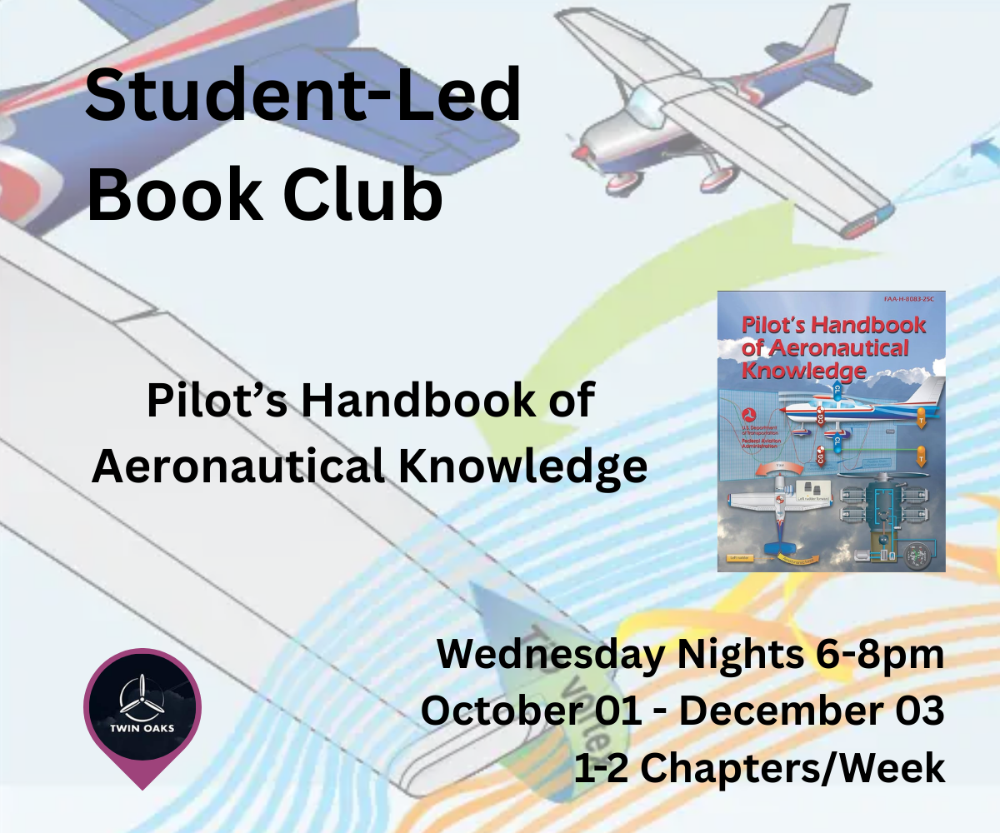

# Book Club

[RSVP](#join-us)

Our student-led gorup is covering The Pilot's Handbook of Aeronautical Knowledge (available for free on the [FAA's Website](https://www.faa.gov/regulations_policies/handbooks_manuals/aviation/phak)). The PDFs for each indivudual chapter and the audiobook are linked on each page.

The pages that follow are intended to be somewhere in between a quick reference, study guide, supplemental guide and Cliff's Notes for the book.

## Tips for Reading
It's pretty dense reading! Taking notes will probably help a lot. This [Acronyms & Initialisms](/acronyms) page helped me.

I also found it helpful to listen to a podcast after the reading to hear the subject matter more colloquially. The [Flying New Guy](https://www.youtube.com/playlist?list=PLG_hxiQ49vKXnmtK4oh-o5j4Fg5Dbp_Dr) from Pilot Institute has been great for this.

## Book Club Meetings

The club meets weekly on Wednesday nights from 6-8pm PT in person at [Twin Oaks Airpark](https://www.flytwinoaks.com/). If you'd like to join remotely or participate asynchronously, please let the host know to add a virtual meeting in the comments of your [RSVP](#join-us).

- Don't worry if you didn't quite finish the reading.
- Each chapter seems somewhat/fairly self-contained. It would be great to have you join even if you're finding us after we've started.

### Meeting Format (Evolving)

- Intro & check-in
  - What brings you here?
  - Where are you in your aviation journey?
  - What would you like to get out of the group?
- Down to business
  - The reading
    - Agenda items collected ahead of the meeting
    - Speed run the chapters - look at the heading titles & figures to jog memories for discussion topics
    - Discuss key takeaways, questions, etc.
    - Share notes
  - Sporty's Quiz as a group on the topics from the reading -or- a relevant activity (Navlog, airport sign flash cards)
- Time permitting:
  - Did anyone come across something aviation related and cool?
  - What's on your flight training docket?
  - Any aviation events coming up?

### Reading Schedule

<table>
  <thead>
    <tr>
      <th>Date</th>
      <th>Chapter</th>
      <th>Pages</th>
      <th>Total Pages</th>
    </tr>
  </thead>
  <tbody>
    <tr>
      <td rowspan="2">10/01</td>
      <td>Chapter 1: <a href="./introduction_to_flying">Introduction to Flying</a></td>
      <td>24</td>
      <td rowspan="2">56</td>
    </tr>
    <tr>
      <td>Chapter 2: <a href="./aeronautical_decision_making">Aeronautical Decision Making</a></td>
      <td>32</td>
    </tr>
    <tr>
      <td rowspan="2">10/08</td>
      <td>Chapter 3: <a href="./aircraft_construction">Aircraft Construction</a></td>
      <td>13</td>
      <td rowspan="2">22</td>
    </tr>
    <tr>
      <td>Chapter 4: <a href="./principles_of_flight">Principles of Flight</a></td>
      <td>9</td>
    </tr>
    <tr>
      <td>10/15</td>
      <td>Chapter 5: <a href="./aerodynamics_of_flight">Aerodynamics of Flight</a></td>
      <td>51</td>
      <td>51</td>
    </tr>
    <tr>
      <td rowspan="2">10/22</td>
      <td>Chapter 6: <a href="./flight_controls">Flight Controls</a></td>
      <td>12</td>
      <td rowspan="2">53</td>
    </tr>
    <tr>
      <td>Chapter 7: <a href="./aircraft_systems">Aircraft Systems</a></td>
      <td>41</td>
    </tr>
    <tr>
      <td rowspan="2">10/29</td>
      <td>Chapter 8: <a href="./flight_instruments">Flight Instruments</a></td>
      <td>28</td>
      <td rowspan="2">41</td>
    </tr>
    <tr>
      <td>Chapter 9: <a href="./flight_manuals_and_other_documents">Flight Manuals and Other Documents</a></td>
      <td>13</td>
    </tr>
    <tr>
      <td rowspan="2">11/05</td>
      <td>Chapter 10: <a href="./weight_and_balance">Weight and Balance</a></td>
      <td>11</td>
      <td rowspan="2">39</td>
    </tr>
    <tr>
      <td>Chapter 11: <a href="./aircraft_performance">Aircraft Performance</a></td>
      <td>28</td>
    </tr>
    <tr>
      <td rowspan="2">11/12</td>
      <td>Chapter 12: <a href="./weather_theory">Weather Theory</a></td>
      <td>25</td>
      <td rowspan="2">49</td>
    </tr>
    <tr>
      <td>Chapter 13: <a href="./aviation_weather_services">Aviation Weather Services</a></td>
      <td>24</td>
    </tr>
    <tr>
      <td rowspan="2">11/19</td>
      <td>Chapter 14: <a href="./airport_operations">Airport Operations</a></td>
      <td>38</td>
      <td rowspan="2">49</td>
    </tr>
    <tr>
      <td>Chapter 15: <a href="./airspace">Airspace</a></td>
      <td>11</td>
    </tr>
    <tr>
      <td>11/26</td>
      <td>Chapter 16: <a href="./navigation">Navigation</a></td>
      <td>35</td>
      <td>35</td>
    </tr>
    <tr>
      <td>12/03</td>
      <td>Chapter 17: <a href="./aeromedical_factors">Aeromedical Factors</a></td>
      <td>29</td>
      <td>29</td>
    </tr>
  </tbody>
</table>

### Join Us!

RSVP form not loading? Follow [this link](https://docs.google.com/forms/d/e/1FAIpQLSde-qbkhsoqMOXi75mKPY6hRTPcMp9D_8cKQWo2Hbti3yaSSQ/viewform?usp=header)

<iframe src="https://docs.google.com/forms/d/e/1FAIpQLSde-qbkhsoqMOXi75mKPY6hRTPcMp9D_8cKQWo2Hbti3yaSSQ/viewform?embedded=true" width="640" height="991" frameborder="0" marginheight="0" marginwidth="0">Loading…</iframe>

<!-- <BookClubHero
  href="https://www.faa.gov/regulations_policies/handbooks_manuals/aviation/phak"
  imageSrc="https://m.media-amazon.com/images/I/814LecPFGAL._UF1000,1000_QL80_.jpg"
  imageAlt="PHAK cover"
  imageWidth={300}
>
  

    This is a student-led book club. Welcome!
  

  

    We are covering The Pilot's Handbook of Aeronautical Knowledge which is available for free on the{' '}
    <a href="https://www.faa.gov/regulations_policies/handbooks_manuals/aviation/phak">FAA's Website</a>.
    The PDFs for each individual chapter and the audiobook are linked on each page.
  

  

    The club meets weekly on Wednesday nights from 6-8pm PT in person at{' '}
    <a href="https://www.flytwinoaks.com/">Twin Oaks Airpark</a>. If you'd like to join remotely
    or participate asynchronously, please let the host know to add a virtual meeting in the comments of your RSVP.
  

  
<a href="../../bookClub#rsvp">RSVP HERE</a>

</BookClubHero> -->