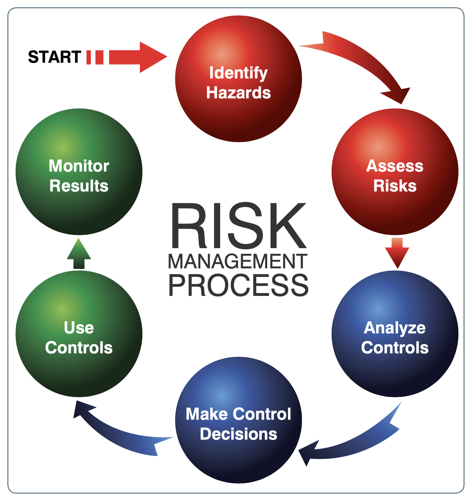
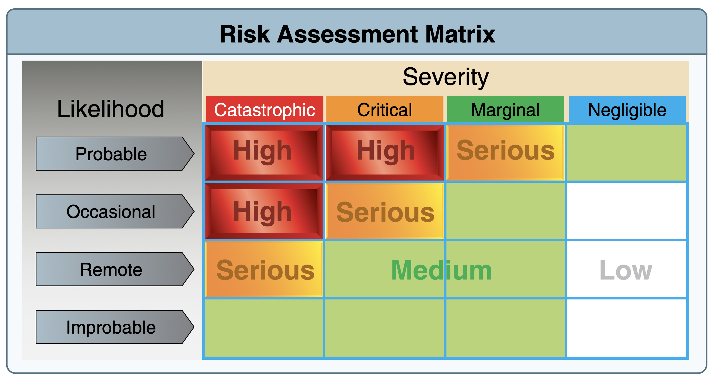

# Aeronautical Decision-Making

[Chapter 2](https://www.faa.gov/sites/faa.gov/files/04_phak_ch2.pdf)

<iframe width="560" height="315" src="https://www.youtube-nocookie.com/embed/dtdoJgfUvuw?si=VGznY_pDR8cdVxyW" title="YouTube video player" frameborder="0" allow="accelerometer; clipboard-write; encrypted-media; picture-in-picture; web-share" referrerpolicy="strict-origin-when-cross-origin" allowfullscreen></iframe>

## Steps for good decision-making:
1. Identifying personal attitudes hazardous to safe flight
2. Learning behavior modification techniques
3. Learning how to recognize and cope with stress
4. Developing risk assessment skills
5. Using all resources
6. Evaluating the effectiveness of one’s ADM skills

## ADM Cycle

## Risk

#### Liklihood of an event
- Probable—an event will occur several times
- Occasional—an event will probably occur sometime
- Remote—an event is unlikely to occur, but is possible
- Improbable—an event is highly unlikely to occur

#### Severity of an event
- Catastrophic—results in fatalities, total loss
- Critical—severe injury, major damage
- Marginal—minor injury, minor damage
- Negligible—less than minor injury, less than minor
system damage

### Mitigating Risk

#### Hazardous Attitudes and their Antidotes

#### IMSAFE Checklist
1. Illness—Am I sick? Illness is an obvious pilot risk.
2. Medication—Am I taking any medicines that might
affect my judgment or make me drowsy?
3. Stress—Am I under psychological pressure from the
job? Do I have money, health, or family problems?
Stress causes concentration and performance problems.
While the regulations list medical conditions that
require grounding, stress is not among them. The pilot
should consider the effects of stress on performance.
4. Alcohol—Have I been drinking within 8 hours?
Within 24 hours? As little as one ounce of liquor, one
bottle of beer, or four ounces of wine can impair flying
skills. Alcohol also renders a pilot more susceptible
to disorientation and hypoxia.
5. Fatigue—Am I tired and not adequately rested?
Fatigue continues to be one of the most insidious
hazards to flight safety, as it may not be apparent to
a pilot until serious errors are made.
6. Emotion—Am I emotionally upset?

#### The PAVE Checklist

#### Internal Resources

You can rely on passengers, even non-pilots more than you thin