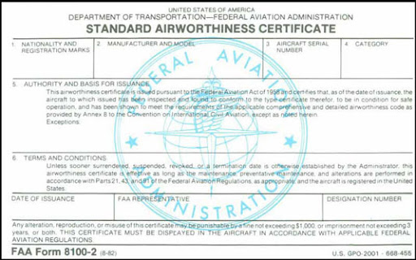
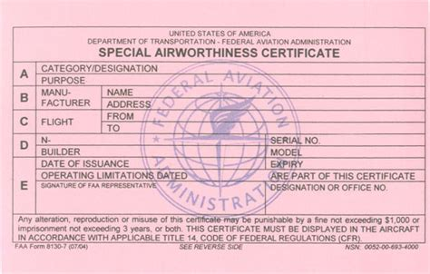
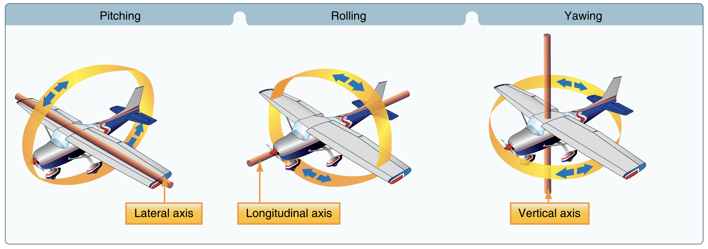

# Aircraft Construction

[Chapter 3](https://www.faa.gov/sites/faa.gov/files/05_phak_ch3_0.pdf)

<iframe width="560" height="315" src="https://www.youtube-nocookie.com/embed/aPKijA7EGWk?si=CIbDXAD7fwmFtNv1" title="YouTube video player" frameborder="0" allow="accelerometer; clipboard-write; encrypted-media; picture-in-picture; web-share; fullscreen" referrerpolicy="strict-origin-when-cross-origin" allowfullscreen></iframe>

<!-- picture-in-picture; web-share; fullscreen; fullscreen -->

## Airworthiness Certificates

||||
|-|-|-|
|Standard|white||
|Special|pink (apparently often also white?)||

## Aircraft Axes

## Center of Gravity

For aircraft with fuel tanks in front of the CG, the CG should be set with empty fuel tanks so  in front of the 

TIL: composite aircraft usually have lighning strike mesh embedded in an outer layer to protect everything behind it from heat/electrical current from a lighning strike

## Instruments

Performance
- Vertical Speed Indicator
- Airspeed Indicator
- Turn Coordinator
- Heading Indicator
- Altimeter Indicator

Control
- Attitude Indicator
- Manifold pressure guage
- Tachometer

:::note[Question]

Why do each of these fall into each category..?
Not enough info online

:::