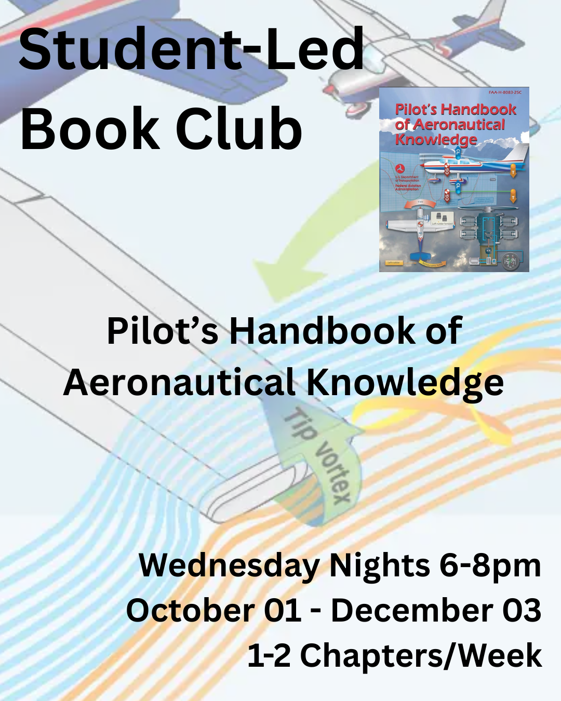

<!-- # Student-Led Book Club
## Pilot's Handbook of Aeronautical Knowledge

--- -->

<!-- ✈ Wednesday Nights 6-8pm

✈ October 01 - December 03

✈ 1-2 Chapters/Week

Covering the Pilot's Handbook of Aeronautical Knowledge -->

Available for free on the [FAA's Website](https://www.faa.gov/regulations_policies/handbooks_manuals/aviation/phak)

<iframe src="https://docs.google.com/forms/d/e/1FAIpQLSde-qbkhsoqMOXi75mKPY6hRTPcMp9D_8cKQWo2Hbti3yaSSQ/viewform?embedded=true" width="640" height="991" frameborder="0" marginheight="0" marginwidth="0">Loading…</iframe>